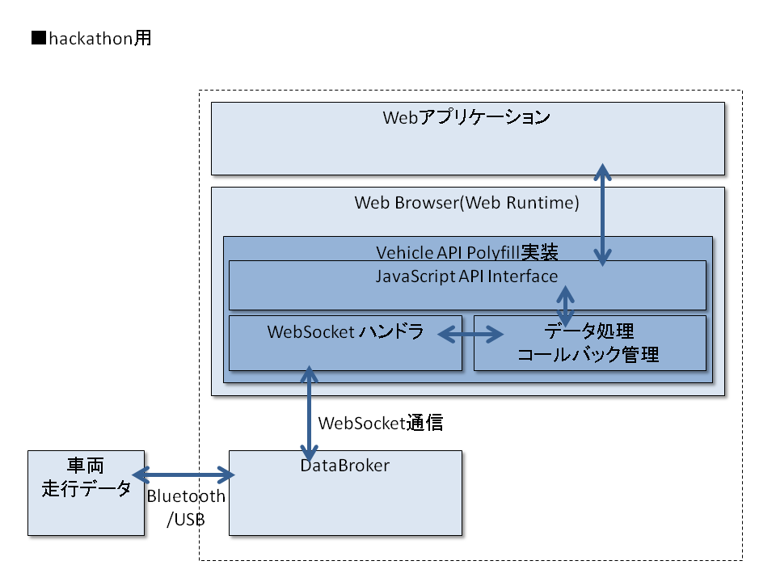
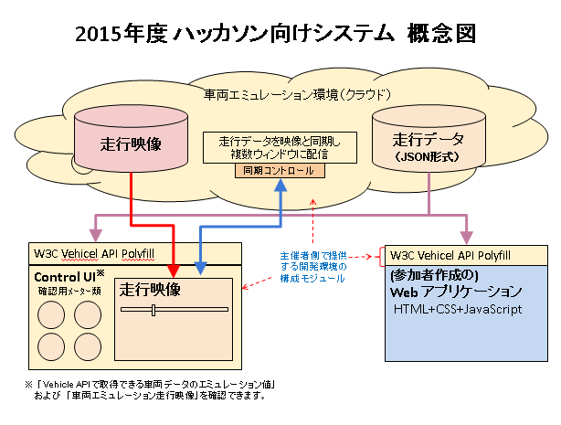
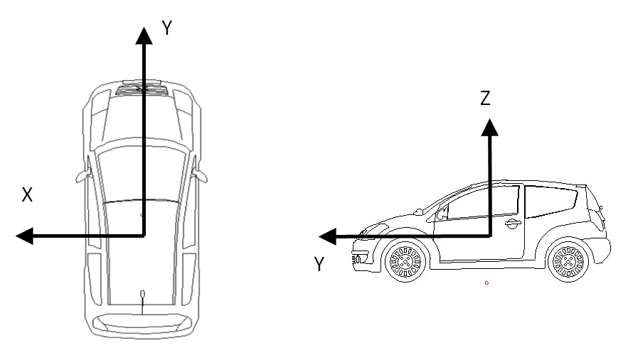

# Webとクルマのハッカソン 開発環境 ReadMe

## Doc

### W3C Vehicle API について

* W3C Automotive And Web Platform Business Group [link](https://www.w3.org/community/autowebplatform/)
    * 2013年1月活動開始。Vehicle APIについては2014年12月にFinal Business Group Reportとしてドラフトを公開。

* W3C Automotive Working Group [link](https://www.w3.org/auto/wg/)
    * Vehicle APIの仕様策定をBusiness Groupから引き継ぎ、作業継続中。

* W3C Vehicle API Spec(Final Business Group Report)
    * Vehicle Information API [link](https://www.w3.org/2014/automotive/vehicle_spec.html)
    * Vehicle Data Interfaces [link](https://www.w3.org/2014/automotive/data_spec.html)

### Vehicle API システム概要

* Toyota Prius 3rd generation

* Vehicle API システム構成図

    (本技術は、総務省の『ICTを活用した次世代ITSの確立』（SIP自動走行システムの一部） 
    による委託を受けて実施した研究開発の成果を活用しています。)

* Vehicle API Polyfillについて

### 利用可能データ項目リスト

|*interface*|*attribute*|*備考*|
|:----------|:----------|:------------|
|VehicleSpeed|  speed|  |
|EngineSpeed|   speed|  |
|VehiclePowerModeType|  value|イグニッションの状態|
|AccelerationPedalPosition| value|  |
|Transmission|  mode|グラフ上はGearと表示。取得状況が不安定な場合があります|
|LightStatus|   head||
||  brake||
||  parking|取得状況が不安定な場合があります|
|Fuel|  level||
||  instantConsumption| |
|Acceleration|  x|  |
||  y|  |
||  z|  |
|Gyro|  x(pitch)|   |
||  y(roll)|    |
||  z(yaw)| |
|SteeringWheel|angle|   |
|BrakeOperation|    brakePedalDepressed|    |
|Odometer|  distanceTotal|  |
|Door|  status|f-r, f-lのみ|
|Seat|  seatbelt|front-rightのみ|
|ParkingBrake|  status||
|Gps|   latitude||
||  longitude|  |
||  altitude|精度に制限があり参考値となります|
||  heading|    |
||  speed|  |

## SDK

### ハッカソン開発環境

### マップツール（走行データ閲覧ツール）

* 走行データを地図、グラフで閲覧できる。使用したいイベントが含まれるデータを探すことができる
1. [MapTool](http://52.193.125.145:3000/MapTool/osm_mapping.html) を開く
2. ドロップダウンから走行データを選択する

### Control-UI

1. [Control-UI](http://52.193.125.145:3000/cluster/controlindex.html?json=20151221-asakusa-skytree.json) を開く
2. `RoomID` テキストボックスにユニークな文字列を入れ、`Connect`をクリック
3. クライアントアプリケーションを起動しておく(下記ApplicationSampleを参照)
4. ドロップダウンから走行データを選択する
5. YouTubeコンテンツ内の再生ボタンをクリック
6. 動画再生に同期した走行データが配信されControl-UI上のメーターが動作する
7. 同時にクライアントアプリケーションにも走行データが配信され、VehicleAPIが作動する
注)RoomIDに'aaa'などの単純な文字列を使用すると、他の参加者のRoomIDと重複して動作が不正になる可能性があります
メールアドレスなどユニークさが保証される文字列の使用を推奨します

### ApplicationSample

クライアントアプリケーションの作り方はApplicationSampleをご参照ください。Control-UIとの連携動作に必要な最低限のコードで記述されています。

* [vehicleSpeed](https://github.com/access-company/AutoWeb-Hackathon/blob/master/ApplicationSample/vehicleSpeed.html)
* [location](https://github.com/access-company/AutoWeb-Hackathon/blob/master/ApplicationSample/location.html)

1. ApplicationSampleのコードをgithubから取得し、参加者の実行環境に配置する
2. ApplicationSampleのコード中のRoomID値をControl-UIに設定するRoomIDと合わせておく
3. ApplicationSampleをChromeブラウザで起動して、Control-UIからの走行データ配信を待つ

## 走行データ

利用可能な走行データ（経路、発生イベント)については下記リストをご参照ください。
また各走行データの詳細についてはマップツールでご確認ください。
* 走行パターンリスト [link](./doc/files/course_list.pdf)

## マッシュアップAPI

ご協賛をいただいた各社のWebAPIを以下にご紹介します。

* インクリメントP [link](https://github.com/access-company/AutoWeb-Hackathon/blob/master/doc/files/incrementp/upload_file.zip)
    * インターネット地図配信サービス「Map Fan API」

* twilio [link](https://github.com/access-company/AutoWeb-Hackathon/blob/master/doc/files/twilio/twilio_howto.txt)
    * 電話/SMSとつながるクラウドAPIサービス「twilio」

* 昭文社
    * 観光スポット情報配信サービス「MAPPLE観光情報API」
    * 一部機能制限があります。
        * MAPPLE観光情報API      : 会場内、かつ、SOAPベースのAPIのみ利用可
        * MAPPLE API POIプラス   : 会場内、かつ、SOAPベースのAPIのみ利用可
        * MAPPLE API （地図画像）: 利用制限なし

    * (詳細は当日配布資料にてご紹介させていただきます)

* YuMake
    * 天気予報、防災情報、潮汐情報など「YuMake気象情報API」
    * (詳細は当日配布資料にてご紹介させていただきます)

* 富士通テン
    * 今回の走行データに同期した左右車線との距離、前方車両との距離情報のAPI
    * (詳細は当日配布資料にてご紹介させていただきます)

## 注意事項

* 作業用ブラウザには Google Chrome をご使用ください。

* 本開発環境では、Gps情報もその他の車両走行データと同経路で取得するため、通常のW3C Geolocation APIでは取得できません。
そのため、W3C Vehicle APIと類似した形式の位置情報取得APIを準備しました。使用方法はApplicationSampleのlocationを参照ください。

* instantConsumptionの単位はg/sとなっており、0 ～ 2000g/secといった値を取ります。
ただし、燃料噴射は瞬間的なもので1秒など連続するものではなく、2000g/secという値を取ったとしても、
1秒で2kgの燃料を消費するわけではありません。

* Altitudeの値は誤差が大きいため参考値となります。

* VehiclePowerModeTypeとは、車両のイグニッションの状態を表します。
今回の場合は'Running'以外の取得はできません。
(Engien Crankingはイグニッションキーを回してセルモーターがエンジンを起動している状態です)

* 車両の座標系について

* 以下については走行データが途中で終了または一部欠けていますのでご注意ください。
  (動画より先に走行データの再生が終了するとControl-UIのメーターの動作が止まりますが、動画の再生はそのまま継続されます)
    * 01.浅草寺雷門→言問橋
    * 11.塩浜→東京タワー(Theta)

* 以下については事情により走行中の動画の撮影ができなかったため、代替の動画が再生されます。
    * 28.高津→等々力アリーナ（成人式）→246号→飯田橋
    * 65.三角池→木戸池
    * 66.前山ゲレンデ→蓮池

* 3DカメラThetaの動画はControl-UI上のYoutubeウインドウでマウス操作により視点変更が可能です。ただし、確認した限りではUbuntu12.04上のGoogle ChromeではYoutubeの3D動画機能が正しく動作しませんでした。

* バックアップ用サーバ
  Control-UI用サーバは上記に紹介したものを主に使用しますが、障害発生時のためにバックアップ用の2ndサーバを準備してあります。
    * 1stサーバ:
        * http://52.193.125.145:3000/cluster/controlindex.html?json=20151221-nihonbashi-ginza.json
        * http://52.193.125.145:3000/MapTool/osm_mapping.html
    * 2ndサーバ:
        * http://52.193.60.25:3000/cluster/controlindex.html?json=20151221-nihonbashi-ginza.json
        * http://52.193.60.25:3000/MapTool/osm_mapping.html

## ファイル

* ハッカソンガイダンス スライド [link](./doc/files/hackathon_guidance.pdf)

* WebをクルマにつなぐW3Cの国際標準化
  (慶応大学 芦村先生 スライド) [link](./doc/files/w3c_doukou.pdf)

## FAQ

wikiの[FAQ](https://github.com/access-company/autoweb-hackathon/wiki)をご参照ください。
(当日、会場での質問なども適宜アップしていきます)

