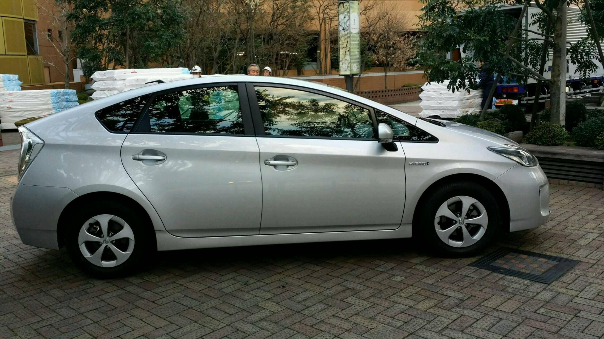
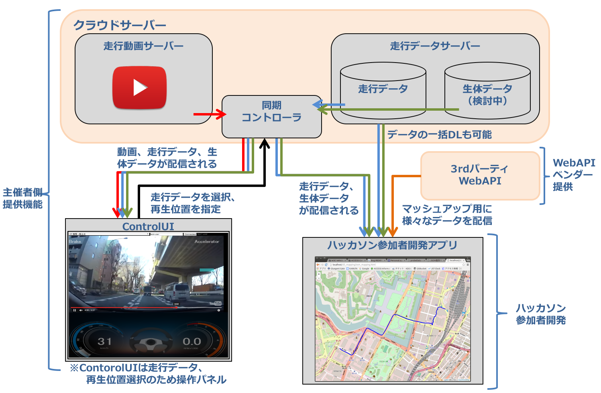
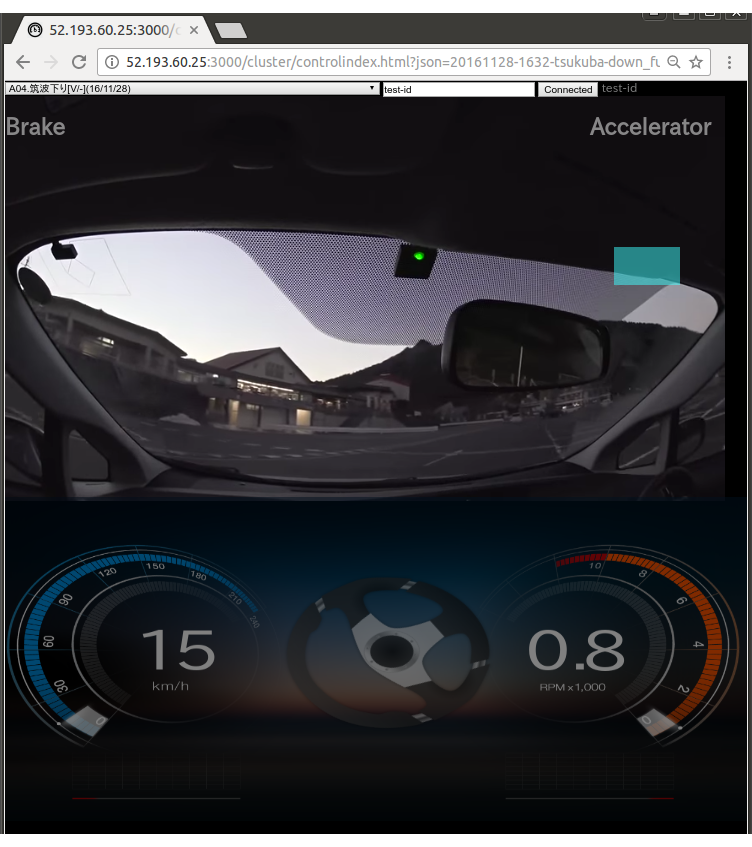
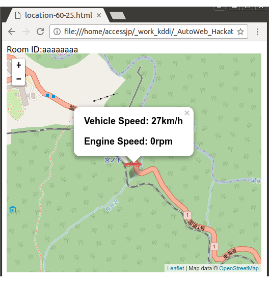
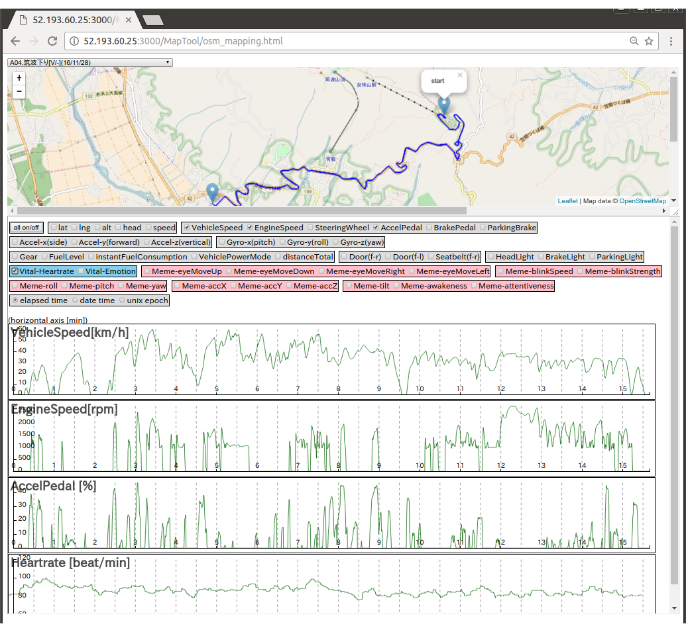
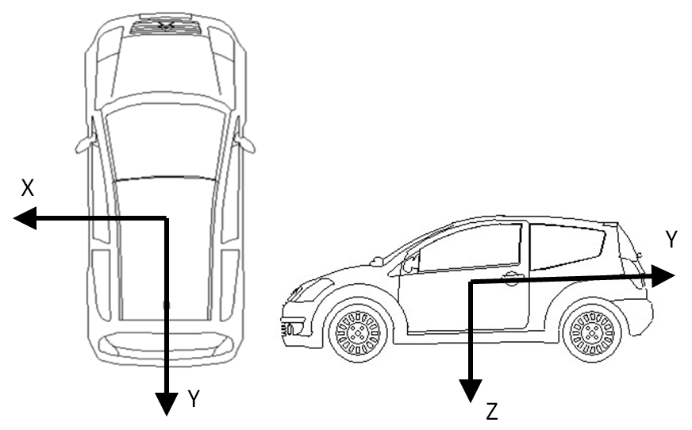
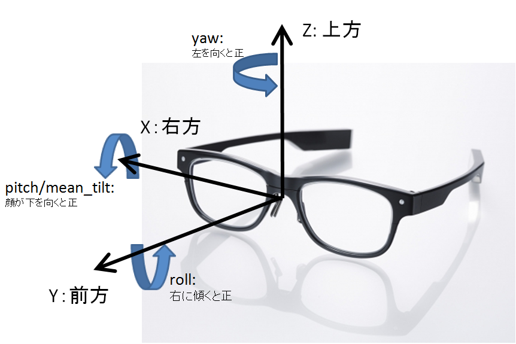

# Webとクルマのハッカソン2017 開発環境 ReadMe

## 1. W3C Vehicle API について
* W3C Automotive And Web Platform Business Group [link](https://www.w3.org/community/autowebplatform/)
    * 2013年1月活動開始。Vehicle APIについては2014年12月にFinal Business Group Reportとしてドラフトを公開。

* W3C Automotive Working Group [link](https://www.w3.org/auto/wg/)
    * Vehicle APIの仕様策定をBusiness Groupから引き継ぎ、作業継続中。
    * 当初は Business Groupから引き継いだ JavaScript API形式の Vehicle API を推進していたが、2016年に API のアーキテクチャを見直し、現在は WebSocket によるサービス形式の新仕様の Vehicle API の定義を推進している。

### 本ハッカソンで使用するAPI
* Spec document
    * Vehicle Information Access API [link](https://www.w3.org/TR/vehicle-information-api/)
    * Vehicle Data Interfaces [link](https://www.w3.org/TR/vehicle-data/)
* コード例:[link](https://www.w3.org/TR/vehicle-information-api/#introduction)
* 一般的なHTML5 API と同じくブラウザ組み込みのJavaScript APIとして定義されている

### [参考]策定中の最新仕様
* Spec document
    * Vehicle Information Service Specification [link](https://www.w3.org/TR/vehicle-information-service/)
    * Vehicle Signal Client Specification (not ready)
* コード例:[link](https://www.w3.org/TR/vehicle-information-service/#introduction)
* 新APIは車両に搭載したローカルサーバからWebSocketでJSONフォーマットの車両データを受け取り利用するシステム構成となっておりブラウザによるサポートが必要とされない

### ＊最新仕様はまだ定義中の部分があるため、本ハッカソンでは前バージョンのAPIを使用します

## 2.ハッカソン開発環境について

対象車両: TOYOTA Prius 3rd generation 
TOYOTA Priusでのテスト走行により走行データを収集しました 

#### システム構成図

#### A. ハッカソンサーバー（クラウドサーバー）
ハッカソンサーバーは走行データ（及び、その他センサー系データ）を格納し、Control-UIによる走行パターンのリクエストを受けて、動画の再生とタイミング同期した走行データ（及びセンサー系データ）の配信を行う。 
Control-UI だけでなく、同じ RoomID を指定したクライアントアプリケーション（複数可）にも走行データが配信される。

#### B. Control-UI
ハッカソンサーバーを利用するためのUI。利用したい走行パターンを選択すると、走行動画と走行データが同期した状態で再生される。

 
* 1stサーバ:
http://52.193.60.25:3000/cluster/controlindex.html?json=20151221-nihonbashi-ginza.json
* 2ndサーバ:
http://13.112.91.95:3000/cluster/controlindex.html?json=20151221-nihonbashi-ginza.json

##### 操作手順

1. Control-UI をブラウザで開く
2. RoomID テキストボックスにユニークな文字列を入れ、Connect をクリック 
3. クライアントアプリケーションを起動しておく(下記ApplicationSampleを参照)
4. Control-UIのドロップダウンリストから走行パターンを選択する
5. 動画エリア内の再生ボタンをクリック
6. 動画が再生すると共に、走行データが動画と同期して配信されControl-UI上のメーターが動作する
7. 同時にクライアントアプリケーションにも走行データが配信され、VehicleAPIによるデータ取得が実行される

注)RoomIDに'aaa'などの単純な文字列を使用すると、他の参加者のRoomIDと重複して動作が不正になる可能性があります 
メールアドレスやその他ユニークさが保証される文字列を使用してください

#### C. クライアントアプリケーション（ハッカソン参加者開発アプリ）
ハッカソン参加者の皆様が開発するWebアプリケーションです。 ハッカソンSDKで利用可能となる W3C Vehicle APIを使用することで、自動車の走行情報（及び、走行中のセンサー系データ）を利用できます。 
クライアントアプリケーションの作り方はApplicationSampleをご参照ください。 Control-UIとの連携動作に必要な最低限のコードで記述されています。 

クライアントアプリケーション例 

##### ApplicationSample

* https://github.com/access-company/AutoWeb-Hackathon.git
    * ApplicationSample/vehicleAll.html
    * ApplicationSample/sensorAll.html
    * ApplicationSample/location.html

##### 使用手順
1. ApplicationSampleのソースをgithubから取得する 
`$ git clone https://github.com/access-company/AutoWeb-Hackathon.git`
2. サンプルソース（例：vehicleAll.html）中のscriptタグでインクルードするJavaScriptファイルのサーバーIPを、Control-UIのIP に合わせて変更する
3. サンプルソース中のRoomID値をControl-UIに設定するRoomIDと合わせて変更する
4. サンプルソースを HTTPサーバー(e.g. Apache, python SimpleHTTPServer, etc.)に配置する
    * python SimpleHTTPServer の場合は下記を実行

        `python -m SimpleHTTPServer`

4. サンプルソースをChromeブラウザで起動して Control-UIからの走行データ配信を待つ
5. 起動済のControl-UIで走行パターンを選択、再生ボタンを押下すると、vehicleall.html にも走行データが配信されアプリケーションが動作する

#### D. MapTool
各走行パターンのデータを、地図とグラフ表示で一覧するツール。利用したいデータの変化(例えば急加速、急減速など)が含まれる走行パターンを探すことができる。 

* 1stサーバ:
http://52.193.60.25:3000/MapTool/osm_mapping.html
* 2ndサーバ:
http://13.112.91.95:3000/MapTool/osm_mapping.html

##### 操作手順
1. MapToolのURLをChromeブラウザで開く
2. 画面上のドロップダウンリストから走行パターンを選択する
3. 走行パターンのデータが、地図上へのマッピングとグラフにより表示される 
注) 取り扱うjsonファイルが大きいため、表示まで時間がかかる場合があります

#### E. その他

##### 走行パターンリスト
* 利用可能な走行パターン（経路、発生イベント)については下記リストをご参照ください。 
また各走行パターンのデータの詳細についてはマップツールでご確認ください。 
    * 走行パターンリスト(2015.11～2016.1:センサー系データなし) [link](./doc/files/course_list.pdf)
    * 走行パターンリスト(2016.11～2017.1) [link](./doc/files/course_list2017.pdf)

##### 走行データのダウンロード利用
* 走行データファイル全体をローカルにダウンロードして利用することも可能です。 
走行データは本githubの以下パスに配置してあり、リポジトリのクローンにより取得できます。 
    * https://github.com/access-company/AutoWeb-Hackathon.git
        * json/YYYYMMDD-xxxxxx.json

##### Vehicle API利用コード例

get()

    navigator.vehicle.vehicleSpeed.get().then( //ES6 promise 形式
      function (vehicleSpeed) {console.log("value:"+vehicleSpeed.speed);},
      function (error) {console.log("There was an error");}
    );

subscribe()/unsubscribe()

    var handle = navigator.vehicle.vehicleSpeed.subscribe(
      function (vehicleSpeed) {console.log("value:"+vehicleSpeed.speed);
      navigator.vehicle.vehicleSpeed.unsubscribe(handle);
    });
   
* 各種データの取得方法はApplicationSampleを参照 
https://github.com/access-company/AutoWeb-Hackathon.git
    * ApplicationSample/vehicleAll.html
    * ApplicationSample/sensorAll.html

## 3. データ項目リスト
#### vehicle data

|*interface*|*attribute*|*unit*|*備考*|
|:----------|:----------|:------------|:------------|
|VehicleSpeed|  speed|km/h|車両速度  |
|EngineSpeed|   speed|rpm|エンジン回転数  |
|VehiclePowerModeType| value|- |イグニッションの状態。offとrunningのみ取得可。 0:off, 1:running, 2:accessory, 3:accesory2, 4:engine-cranking|
|AccelerationPedalPosition| value|%|  |
|Transmission|  mode|- |グラフ上はGearと表示。取得状況が不安定な場合があります。  -1:reverse, 0:neutral, 1:parking, 2:low, 3:drive|
|LightStatus|   head|- |0:off, 1:on|
||  brake|- |0:off, 1:on|
||  parking|- |0:off, 1:on 取得状況が不安定な場合があります|
|Fuel|  level|%|燃料残量|
||  instantConsumption|g/sec |燃料消費量 |
|Acceleration|  x|G |左右方向加速度（座標系説明参照）  |
||  y|G |進行方向加速度（座標系説明参照）  |
||  z|G |鉛直方向加速度（座標系説明参照） 重力により静止時 +1G が加わる  |
|Gyro|  x(pitch)|degree/sec |角速度(座標系説明参照) |
||  y(roll)|degree/sec |角速度(座標系説明参照)  |
||  z(yaw)|degree/sec |角速度(座標系説明参照) |
|SteeringWheel|angle|degree|left: plus, right:minus   |
|BrakeOperation|    brakePedalDepressed|0/1| 0:off, 1:on    |
|Odometer|  distanceTotal|km |総走行距離  |
|Door|  status|- |front-right, front-leftのみ。0:open, 1:close|
|Seat|  seatbelt|- |front-rightのみ。0:open, 1:fastened|
|ParkingBrake|  status|- |0:off, 1:on|
|Gps|   latitude|degree|緯度|
||  longitude|degree |経度  |
||  altitude|m|精度に制限があり参考値となります|
||  heading|degree|north:0, East:990, South:180, West:270    |
||  speed|km/h|GPS情報から計算した移動速度  |

#### SDTECH vital data

|*interface*|*unit/value*|*備考*|
|:----------|:------------|:------------|
|Heartrate|bpm|心拍数/分  |
|EmotionCluster|1-25|精神的高揚度(気分の盛り上がり)。1 - 25で評価 心拍数、体の動き(加速度)、音声情報をアルゴリズム評価して算出 25:落ち着いている、1:非常に盛り上がっている |

#### JINS MEME raw data
JINS MEME搭載のセンサーの生データ

|*interface*|*unit/value*|*備考*|
|:----------|:------------|:------------|
|EyeMoveUp|1-3|目の動き(上向き)。1,2,3で評価。0は信号なし  |
|EyeMoveDown|1-3|目の動き(下向き)。1,2,3で評価。0は信号なし  |
|EyeMoveRight|1-3|目の動き(右向き)。1,2,3で評価。0は信号なし  |
|EyeMoveLeft|1-3|目の動き(左向き)。1,2,3で評価。0は信号なし  |
|blinkSpeed|micro volt|まばたきの強さ  |
|blinkStrength|ms|閉眼時間  |
|Meme-roll|degree|頭の角度:横方向(座標系説明参照)  |
|Meme-pitch|degree|頭の角度:正面方向(座標系説明参照)  |
|Meme-yaw|degree|頭の角度:水平方向(座標系説明参照)  |
|Meme-accX|1/16G|頭にかかる加速度(座標系説明参照)  |
|Meme-accY|1/16G|頭にかかる加速度(座標系説明参照)  |
|Meme-accZ|1/16G|頭にかかる加速度(座標系説明参照) 重力により静止状態で Meme-accZ=-16 となる  |

#### JINS MEME processed data
JINS MEME raw dataをアルゴリズム処理して算出した情報

| *interface* | *unit* | *備考* |
|:----------|:------------|:------------|
|Head-tilt|degree|頭の傾き raw dataをアルゴリズム処理して算出  |
|Awakeness|0-100|覚醒値。100-60:覚醒している, 60-40:やや眠い, 40-0:結構眠い |
|Attentiveness|0-100|注意力指数。100-60:注意できている, 60-30:注意力低下, 30-0:注意できていない |

#### 座標系について
車両データとJINS MEMEデータには、x/y/z加速度、ロール/ピッチ/ヨーという3軸データがありますが、車両とJINS MEMEでは座標系が異なりますのでご注意ください。

### 車両データ座標系

### JINS MEME座標系

## 4. QAサポート

* 開催期間中の質疑はチャットアプリ Slack により対応いたします。 
    * Slack: https://vehicleapi2017.slack.com/ 
    * 一般的な質問: [#general](https://vehicleapi2017.slack.com/messages/general/)
    * vehicleAPI、開発環境: [#vehicle_api](https://vehicleapi2017.slack.com/messages/vehicle_api/)
    * マッシュアップAPI: 各APIの channel にて受付

## 5. マッシュアップAPI

ご協賛をいただいた各社のWebAPIを以下にご紹介します。 
APIの情報提供、QA対応は Slack 上で行います。 
Slack上に各API用のchannelが設けてありますので質問を投稿してください。 
Slack: https://vehicleapi2017.slack.com/

* エスディーテック社
    * ドライバーの心拍数、盛り上がり度
    * [doc](./doc/files/sdtech_doc.pdf)
    * 盛り上がり度はドライバーの精神的高揚度をあらわします 1～25 の値をとり、以下のように解釈されます
        * 25: 落ち着いている
        * 1: 非常に盛り上がっている 
    * Slack: https://vehicleapi2017.slack.com/messages/sdtech_api/

* JINS-meme
    * 頭部の加速度（x,y,z）、頭部の回転（roll,pitch,yaw） 
まばたき(強さ、閉眼時間)、視線移動(上下左右を3段階)、視線位置(右、中央、左の3段階) 
覚醒度(100点満点、連続値)、注意力(100点満点、連続値)
    * [doc](./doc/files/jinsmeme_doc.pdf)
    * JINS-meme の roll,pitch,yaw はvehicleAPIの車両データのroll,pitch,yawと単位が異なります
        * 車両データ: 車体の回転角速度 degree/sec
        * JINS-meme: 頭部の回転角度 degree
    * JINS-memeの頭部の加速度（x,y,z）、頭部の回転（roll,pitch,yaw）という3軸情報は 
    座標系が車両データと異なります。 詳しくは [3.データ項目リスト 座標系について](#座標系について)を参照してください

    * Slack: https://vehicleapi2017.slack.com/messages/jinsmeme_api/

* 昭文社
    * MappleAPI 多言語マップAPI 複数の言語表記が可能な日本地図をインターネット経由で配信するAPI
    * [leaflet](./doc/files/mapple_leaflet.pdf)
    * HP: http://products.mappleapis.jp/home/touristmaps.html
    * Slack: https://vehicleapi2017.slack.com/messages/maple_api/

* YuMake
    * 天気情報API（今日明日天気予報、週間天気予報、時系列天気予報、日の出日の入り、注意報警報、地震情報）
    * 情報はSlackに掲載します
    * Slack: https://vehicleapi2017.slack.com/messages/yumake_api/

* IncrementP
    * インターネット地図配信サービス「Map Fan API」
    * Map Fan API https://www.mapfan.com/houjin/api/
    * [doc](./doc/files/incrementP_doc.zip)
    * Slack: https://vehicleapi2017.slack.com/messages/mapfan_api/

* KDDIウェブコミュニケーションズ
    * Twilio API
    * 「Twilio」とは、たった数行のコードで電話やSMSとネットをつなぐことのできるクラウドAPIサービス
    * クイックスタート: https://jp.twilio.com/docs/quickstart/client/javascript
    * ガイド (サンプルコードなど): https://jp.twilio.com/docs/guides?filter-language=node.js
    * APIリファレンス: https://jp.twilio.com/docs/api
    * github: https://github.com/TwilioDevEd/client-quickstart-node
    * Slack: https://vehicleapi2017.slack.com/messages/twillio_api/

## 6. 注意事項

* 開発環境
    * 開発用ツール、サンプルアプリケーションの動作確認は Google Chrome で行っております。
    * ハッカソンサーバーは2系統用意してあります。一方の動作が不安定な場合は、もう一方を試してください。
        * 1stサーバ:
            * http://52.193.60.25:3000/cluster/controlindex.html?json=20151221-nihonbashi-ginza.json
            * http://52.193.60.25:3000/MapTool/osm_mapping.html
        * 2ndサーバ:
            * http://13.112.91.95:3000/cluster/controlindex.html?json=20151221-nihonbashi-ginza.json
            * http://13.112.91.95:3000/MapTool/osm_mapping.html
    * ハッカソンサーバー、Control-UIほかハッカソン開発環境は、期間中であれば会場外のインターネットからも利用可能です。
* 車両データ
    * instantConsumptionの単位はg/sとなっており、0 ～ 2000g/secといった値を取ります。
ただし、燃料噴射は瞬間的なもので1秒など連続するものではなく、2000g/secという値を取ったとしても、
1秒で2kgの燃料を消費するわけではありません。

    * Altitudeの値は誤差が大きいため参考値となります。

    * VehiclePowerModeTypeとは、車両のイグニッションの状態を表します。
今回の場合は'Running'以外の取得はできません。
(Engien Crankingはイグニッションキーを回してセルモーターがエンジンを起動している状態です)

* センサーデータ
    * JINS-meme の roll,pitch,yaw はvehicleAPIの車両データのroll,pitch,yawと単位が異なります
        * 車両データ: 車体の回転角速度 degree/sec
        * JINS-meme: 頭部の回転角度 degree
    * JINS-memeの頭部の加速度（x,y,z）、頭部の回転（roll,pitch,yaw）という3軸情報は 
    座標系が車両データと異なります。 詳しくは [3.データ項目リスト 座標系について](#座標系について)を参照してください
    * JINS-memeの頭部の回転（roll,pitch,yaw）のゼロ位置は端末によるキャリブレーションによります。 今回キャリブレーション値を記録していないため、MapToolのグラフ表示から適宜補正を加えてください。
    * JINS-memeの頭部の回転のyaw値は、頭の動きと車体の動きの合算になります。(頭が動かなくても車体の向きが変わると、JINS-memeのyaw値は変化します) 頭部の回転だけを取り出すには、走行データの heading 値による補正が必要です。
    * SDTech, JINS-meme のセンサーデータは 車両データと合わせて走行データjsonに記録されています

* マッシュアップAPI

* 走行パターンデータ
    * 走行パターンの中には、走行データ、センサーデータが、先頭部分、途中または末端で欠けているものがありますのでご注意ください。データの欠けはMapToolで確認することができます。
    * 走行パターンにより、SDTech 生体データ、JINS-memeデータの取得の有無があります。 詳細は[走行パターンリスト](#走行パターンリスト)を参照してください。 （または、Control-UI/MapTool のリストボックスのタイトルに V(=生体データ）、M(=JINS-memeデータ) の記号で表示しています）
    * 走行データは Vehicle API によりリアルタイム的に配信を受ける以外に、走行データのjsonファイルをまるごとダウンロードしてjsonをパースして利用することも可能です。 詳しくは[走行データのダウンロード利用](#走行データのダウンロード利用)を参照してください
    * 動画より先に走行データの再生が終了するとControl-UIのメーターの動作が止まりますが、動画の再生はそのまま継続されます
        * 01.浅草寺雷門→言問橋
        * 11.塩浜→東京タワー(Theta)

    * 以下については走行中の動画の撮影ができなかったため、代替の動画が再生されます。
        * 28.高津→等々力アリーナ（成人式）→246号→飯田橋
        * 65.三角池→木戸池
        * 66.前山ゲレンデ→蓮池

    * 3DカメラThetaの動画はControl-UI上のYoutubeウインドウでマウス操作により視点変更が可能です（Google Chromeで確認）。ただし、古いバージョンの Google Chrome ではYoutubeの3Dカメラ機能が正しく動作しませんでした。

